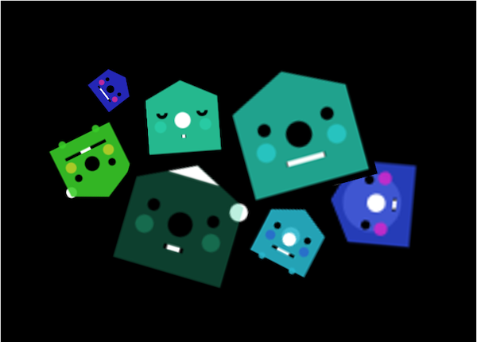
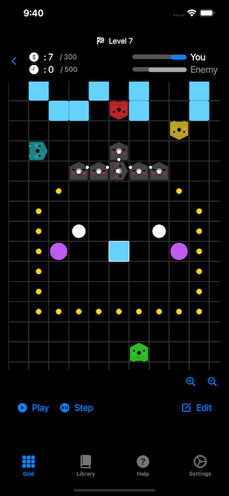
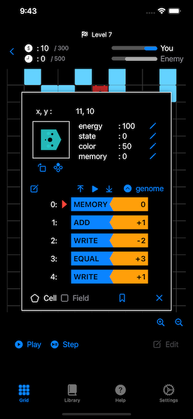
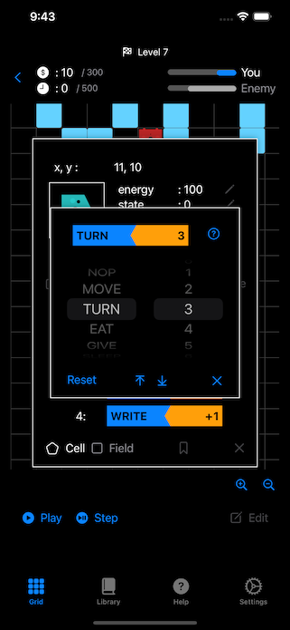
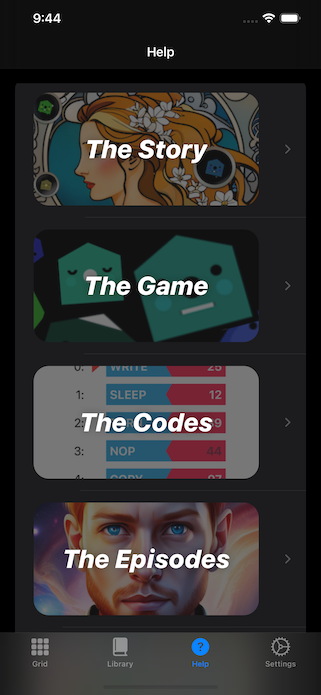

# GoCAKs Game Documentation Repository

Welcome to the official documentation repository for the **_GoCAKs_** game!

## What is GoCAKs?

**_GoCAKs_** is a game where you create programs to battle.

What you create in **_GoCAKs_** is a cellular automaton program. Cellular automata are like programmatic lifeforms that live within a 2D grid world. Based on the given program, they move around, fight, assist allies, and self-replicate.

Programming cellular automata does not require difficult prerequisite knowledge. By simply arranging straightforward instructions, you can achieve advanced behaviors.

Furthermore, programming cellular automata, while simple, is profound. Despite having only a select few instructions and a simple execution model, it's designed so that each individual cell can coordinate like multicellular organisms, realizing complex behaviors.

**_GoCAKS_** has two game modes.

The first is a **_speed-run_** mode with a puzzle sensation, where you clear stages within a limited time and number of moves. In **_speed-run_** mode, as you try to clear stages and think of strategies, fundamental programming concepts like loops, branches, variables, etc., naturally become ingrained.

The second is a **_creative_** mode, where you can freely create a world of cellular automata and a 2D grid. In **_creative_** mode, you can make the cellular automata you've created fight and compete for survival. Additionally, you can let the cellular automata you've created interact and experiment in various ways to see what emergent phenomena arise.

Let's showcase your creativity to the world!

## Screenshots

The Grid

Cell Detail Dialog

Code Editor

Help Menu

## References

### AppStore

[NEWS! GoCAKs 1.0 is now available on the AppStore. Check it out and dive into the action!](https://apps.apple.com/app/GoCAKs/id6462423363)

### YouTube

[@GoCAKs](https://www.youtube.com/@GoCAKs)

### Twitter

[@gocaks_game](https://twitter.com/gocaks_game)

## Privacy Policy

[Our Privacy Policy](PRIVACY-POLICY.md)

## License

This repository is licensed under:

CC BY-ND 4.0

https://creativecommons.org/licenses/by-nd/4.0/
